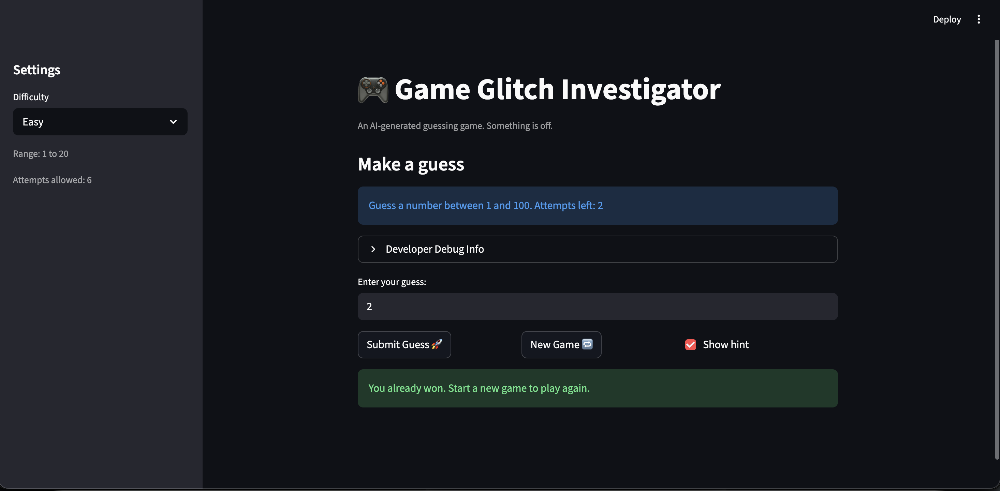
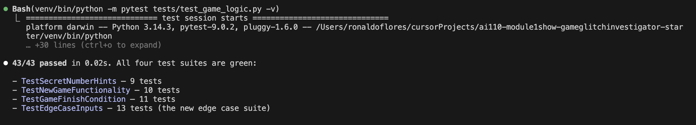
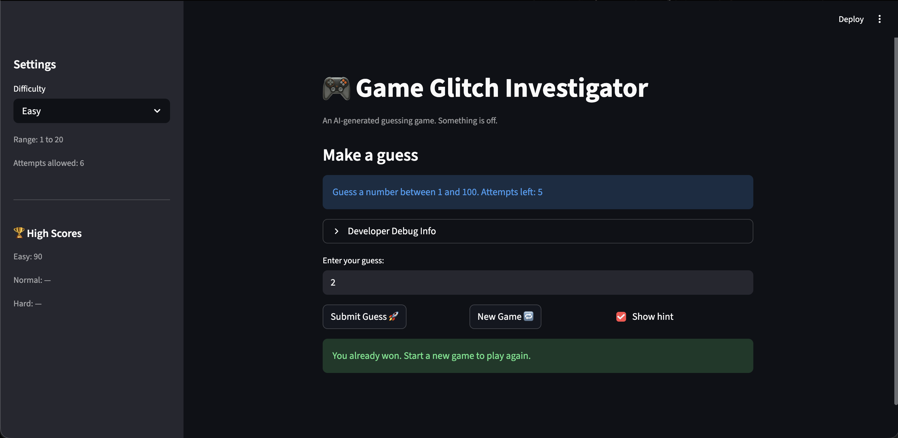

# 🎮 Game Glitch Investigator: The Impossible Guesser

## 🚨 The Situation

You asked an AI to build a simple "Number Guessing Game" using Streamlit.
It wrote the code, ran away, and now the game is unplayable. 

- You can't win.
- The hints lie to you.
- The secret number seems to have commitment issues.

## 🛠️ Setup

1. Install dependencies: `pip install -r requirements.txt`
2. Run the broken app: `python -m streamlit run app.py`

## 🕵️‍♂️ Your Mission

1. **Play the game.** Open the "Developer Debug Info" tab in the app to see the secret number. Try to win.
2. **Find the State Bug.** Why does the secret number change every time you click "Submit"? Ask ChatGPT: *"How do I keep a variable from resetting in Streamlit when I click a button?"*
3. **Fix the Logic.** The hints ("Higher/Lower") are wrong. Fix them.
4. **Refactor & Test.** - Move the logic into `logic_utils.py`.
   - Run `pytest` in your terminal.
   - Keep fixing until all tests pass!

## 📝 Document Your Experience

### Game Purpose

Game Glitch Investigator is a number-guessing game built with Streamlit. The player picks a difficulty (Easy: 1–20, Normal: 1–100, Hard: 1–50), then has a limited number of attempts to guess a randomly chosen secret number. After each guess the game gives a "Too High" or "Too Low" hint. Guessing correctly earns points — fewer points the more attempts it takes. The twist: the original AI-generated code shipped with several bugs, and the real challenge is finding and fixing them.

### Bugs Found

1. **Out-of-range inputs accepted silently** — `parse_guessrun` would accept any integer (e.g. `0`, `-5`, `999`) even if it was outside the current difficulty's valid range. Players could enter nonsense values with no error message.

2. **Non-integer floats silently truncated** — entering `7.9` was converted to `7` via `int(float(raw))` with no warning. The player typed one value but the game evaluated a different one, making feedback confusing (e.g. "Too Low" when `7.9` rounds down to `7`).

3. **Win-score off-by-one** — the score formula was `100 - 10 * (attempt_number + 1)`. Winning on the very first attempt gave `80` points instead of the expected `90`, and every subsequent win was similarly under-rewarded by 10 points.

4. **Score never reset between games** — `st.session_state.score` was not cleared when the "New Game" button was clicked or when the difficulty changed. Points from previous games carried over, making a slow 4-attempt win in game 2 appear to outscore a perfect 1-attempt win from game 1.

5. **"Too High" on even attempts secretly awarded points** — the `update_score` function gave `+5` points whenever a "Too High" guess landed on an even-numbered attempt. Wrong guesses should never reward the player; this inflated scores during longer games and masked the score-reset bug.

### Fixes Applied

1. **Range validation in `parse_guess`** — added `low` and `high` parameters (defaulting to `1` and `100`). After parsing, the function now checks `value < low or value > high` and returns a descriptive error message (e.g. *"Guess must be between 1 and 100."*). `app.py` was updated to pass the difficulty-specific range on every call.

2. **Reject non-integer floats** — `parse_guess` now checks whether a decimal input is a whole number (`float_val != int(float_val)`). If not, it returns an error suggesting the nearest whole numbers (e.g. *"Please enter a whole number (e.g. 7 or 8)."*). Clean whole-number floats like `7.0` are still accepted.

3. **Fix win-score formula** — changed `100 - 10 * (attempt_number + 1)` to `100 - 10 * attempt_number`. Winning on attempt 1 now correctly yields `90` points, attempt 2 yields `80`, and so on, with a minimum of `10`.

4. **Reset score on new game** — added `st.session_state.score = 0` to both the "New Game" button handler and the difficulty-change block in `app.py`, so each game starts from zero.

5. **Remove "Too High" even-attempt bonus** — simplified `update_score` so "Too High" always subtracts 5, same as "Too Low". Wrong guesses now consistently penalize regardless of attempt number.

## 📸 Demo

- 

## 🚀 Stretch Features

### Screenshot of the Challenge 1 being completed 

### Challenge #2 - New Feature: High Score

For this challenge I explain to the AI agent the new feature that I wanted to add and how I wanted it. This feature was the high score record and with the AI in agent mode helped me create the feature.

